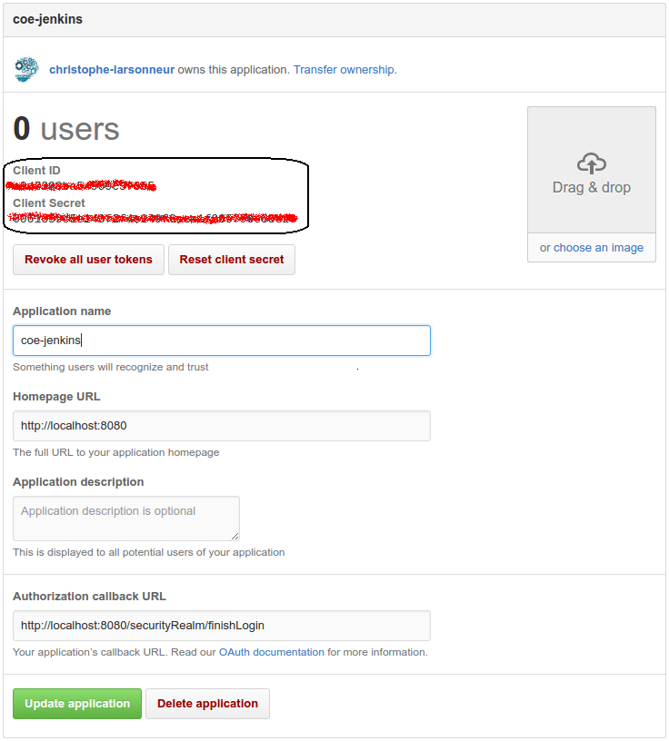

# Github OAuth Plugin

## Introduction

This feature implements the Github OAuth jenkins plugin and help to configure it.

The Github OAuth is used to authenticate your jenkins instance with github.

**WARNING!!!** This feature is incompatible with [basic-security feature](../basic-security).

## How to use it

Before configuring the plugin you must create a GitHub application registration.

1. Visit the following page to create a GitHub application registration: https://github.com/settings/applications/new.
  [
2. The values for application name, homepage URL, or application description don't matter. They can be customized however desired.
3. However, the authorization callback URL takes a specific value. It must be http://myserver.com:8080/securityRealm/finishLogin where myserver.com:8080 is the location of a Jenkins server.

- Add `feature:github-authentication` in your features.lst in your project (Dockerfile or mount)
- Add `GITHUB_URL` in the jenkins environment startup.
- Add `GITHUB_API_URL` in the jenkins environment startup.
- Add `GITHUB_CLIENT_ID` in the jenkins environment startup.
- Add `GITHUB_CLIENT_SECRET` in the jenkins environment startup.
- Optionally, add `GITHUB_OATH_SCOPES` in the jenkins environment startup. By default, scope is set to `read:org,user:email`.

Example:
```
GITHUB_URL="https://github.com"
GITHUB_API_URL="https://api.github.com/"
GITHUB_CLIENT_ID=<GITHUB_CLIENT_ID>
GITHUB_CLIENT_SECRET=<GITHUB_CLIENT_SECRET>
```

TODO: Move GITHUB_CLIENT_ID & GITHUB_CLIENT_SECRET to a file instead of env variables.