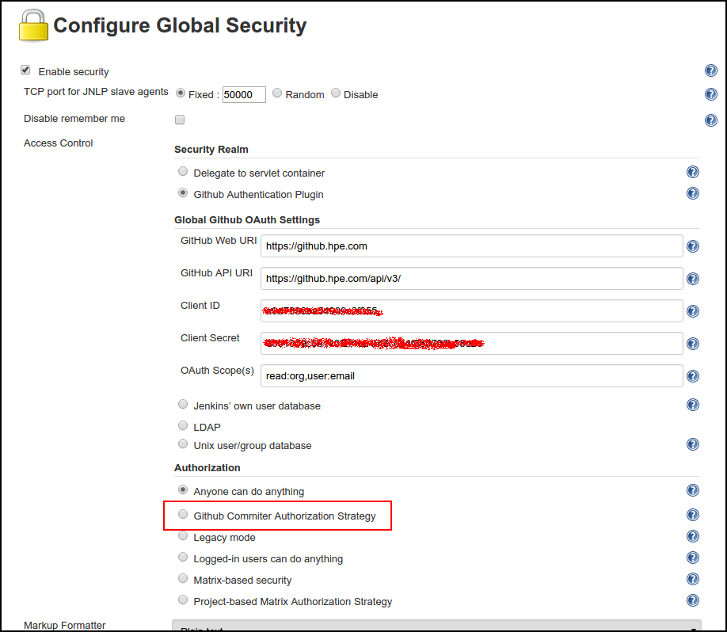
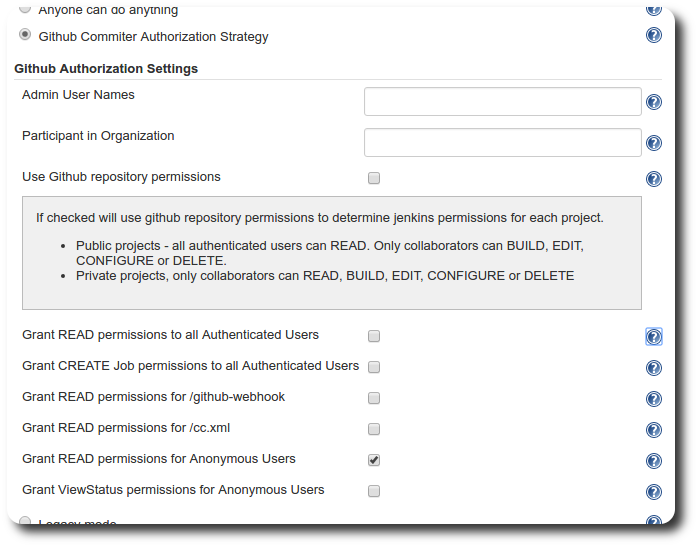

# Github OAuth Plugin

This feature implements the authorization section in Jenkins with the Github OAuth jenkins plugin.



This feature works only if the github-authentication has been fully been configured successfully.

**WARNING!!!** This feature is incompatible with [basic-security feature](../basic-security).

# How to use it?

Before configuring the plugin you **must configure the github-authentication feature.**

- Add `feature:github-authorization` in your features.lst in your project (Dockerfile or mount)
- Add variables in your jenkins environment startup: <br>
  At least `GITHUB_ADMIN_USERS` or `GITHUB_ADMIN_ORG` are required.
  - `GITHUB_ADMIN_USERS`         : Admin User Names
  - `GITHUB_ADMIN_ORG`           : Participant in Organization
  - `GITHUB_ANONYMOUS_READ_PERM` : Optional. Default is False. Optionally you can set it to true if you want to `grant READ permissions for Anonymous Users`. 

By default, `Use Github repository permissions` and `Grant READ permissions to all Authenticated Users` are set to true and all others are set to false.

Example:
```bash
GITHUB_ADMIN_USERS="edward-raigosa, oscar-romero"
GITHUB_ADMIN_ORG="Docker-in-Datacenter"
```

# TODO

- Implement all other checkbox as variables.
- Re-organize authorization code to avoid features conflict.


